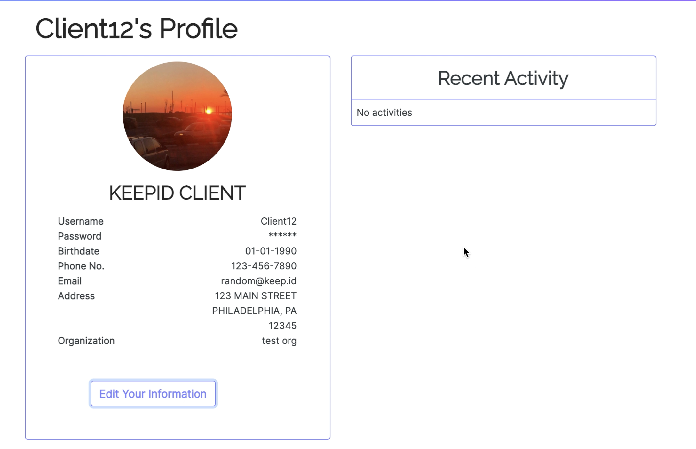
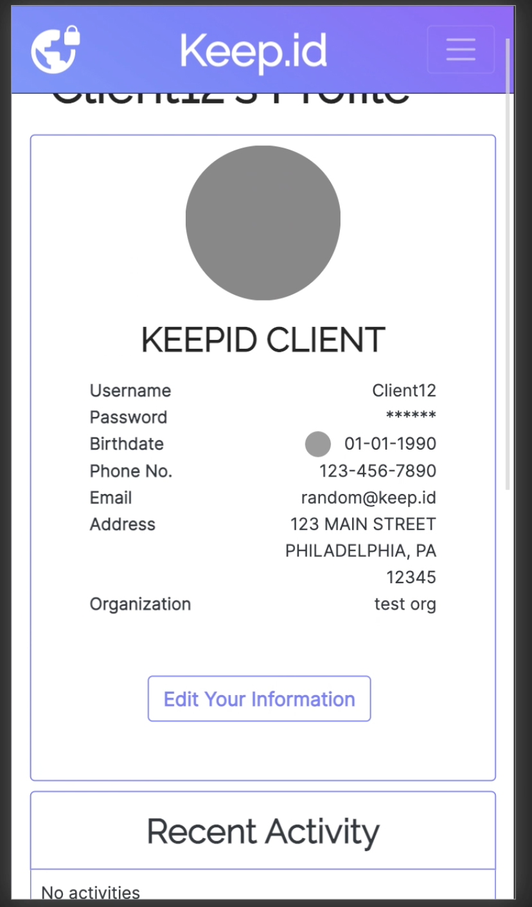

# client-profile-page

Although this file won't work as intended without connection to the backend, it does demonstrate knowledge about fetch calls, functions, state, and bootstrap styling.
I've attached photos and a demo video so you can see how it looks and works. 

To watch demo video, click on the client-profile-page-demo_4MB.mov.zip, then click on the "view raw" button to download the zip file with the video. 

Photos:

